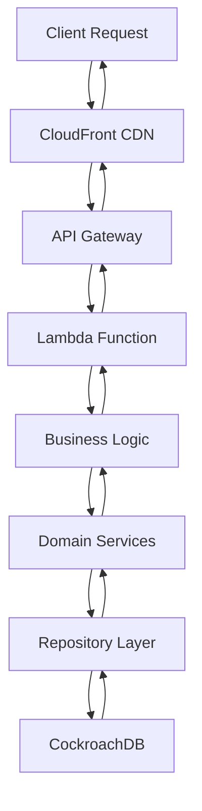
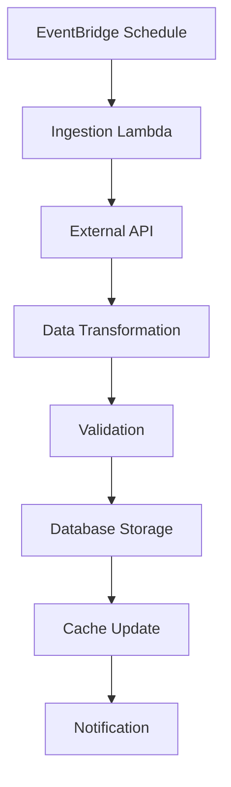
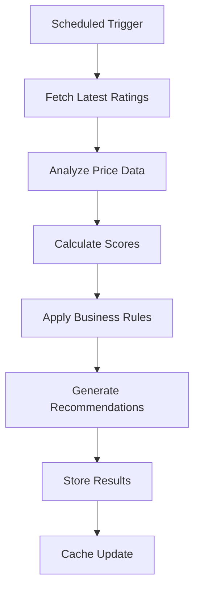

# Architecture Documentation

The Stock Analyzer follows a **Clean Architecture** pattern with **Domain-Driven Design** principles, deployed using a **Serverless Architecture** on AWS. This document provides a comprehensive overview of the system architecture, design decisions, and implementation patterns.

## Table of Contents

1. [Architecture Overview](#architecture-overview)
2. [Domain-Driven Design](#domain-driven-design)
3. [Clean Architecture Layers](#clean-architecture-layers)
4. [Serverless Architecture](#serverless-architecture)
5. [Data Flow](#data-flow)
6. [Design Patterns](#design-patterns)
7. [Technology Stack](#technology-stack)
8. [Security Architecture](#security-architecture)
9. [Performance Considerations](#performance-considerations)
10. [Monitoring & Observability](#monitoring--observability)

## Architecture Overview

The Stock Analyzer is built using a **Hexagonal Architecture** (Ports and Adapters) pattern, ensuring clean separation of concerns and testability:

```
┌─────────────────────────────────────────────────────────────────┐
│                        Presentation Layer                       │
├─────────────────────────────────────────────────────────────────┤
│  Vue.js SPA     │  REST API     │  Lambda Functions            │
│                 │               │                              │
│  • Dashboard    │  • Gin Router │  • API Handler              │
│  • Charts       │  • Middleware │  • Ingestion Service        │
│  • Real-time    │  • CORS       │  • Scheduler                │
└─────────────────────────────────────────────────────────────────┘
                                    │
┌─────────────────────────────────────────────────────────────────┐
│                        Application Layer                        │
├─────────────────────────────────────────────────────────────────┤
│  Handlers       │  Services     │  Use Cases                   │
│                 │               │                              │
│  • HTTP Handlers│  • Business   │  • GetStockRatings          │
│  • Middleware   │    Logic      │  • GenerateRecommendations  │
│  • Validation   │  • Orchestration│  • IngestStockData         │
└─────────────────────────────────────────────────────────────────┘
                                    │
┌─────────────────────────────────────────────────────────────────┐
│                         Domain Layer                            │
├─────────────────────────────────────────────────────────────────┤
│  Entities       │  Value Objects│  Domain Services             │
│                 │               │                              │
│  • StockRating  │  • Pagination │  • RecommendationService    │
│  • Recommendation│  • Price Data │  • IngestionService         │
│  • Stock        │  • Time Periods│  • AlpacaService            │
└─────────────────────────────────────────────────────────────────┘
                                    │
┌─────────────────────────────────────────────────────────────────┐
│                       Infrastructure Layer                      │
├─────────────────────────────────────────────────────────────────┤
│  Repositories   │  Adapters     │  External Services           │
│                 │               │                              │
│  • PostgresRepo │  • Alpaca API │  • CockroachDB              │
│  • StorageRepo  │  • HTTP Client│  • AWS Lambda               │
│  • CacheRepo    │  • Config     │  • CloudWatch               │
└─────────────────────────────────────────────────────────────────┘
```

## Domain-Driven Design

### Bounded Contexts

The system is organized into several bounded contexts:

#### 1. **Stock Trading Context**

- **Entities**: `StockRating`, `StockData`, `PriceBar`
- **Value Objects**: `Ticker`, `Price`, `Volume`
- **Aggregates**: Stock Rating Events
- **Domain Services**: Rating Analysis, Price Calculation

#### 2. **Recommendation Context**

- **Entities**: `StockRecommendation`, `AnalysisResult`
- **Value Objects**: `Score`, `Rationale`, `TechnicalSignal`
- **Aggregates**: Recommendation Engine
- **Domain Services**: Recommendation Generation, Scoring

#### 3. **Data Ingestion Context**

- **Entities**: `IngestionJob`, `DataSource`
- **Value Objects**: `APIEndpoint`, `DataFormat`
- **Aggregates**: Ingestion Pipeline
- **Domain Services**: Data Fetching, Transformation

### Ubiquitous Language

| Term                     | Definition                                           |
| ------------------------ | ---------------------------------------------------- |
| **Stock Rating**         | Analyst recommendation for a stock (Buy, Hold, Sell) |
| **Ticker**               | Stock symbol identifier (e.g., AAPL, MSFT)           |
| **Price Bar**            | OHLCV data for a specific time period                |
| **Recommendation Score** | AI-generated score (0-10) for stock attractiveness   |
| **Technical Signal**     | Bullish/Bearish indicator from technical analysis    |
| **Ingestion**            | Process of fetching and storing external data        |

## Clean Architecture Layers

### 1. Domain Layer (`internal/domain/`)

**Pure business logic with no external dependencies**

```go
// Domain entities
type StockRating struct {
    RatingID   uuid.UUID
    Ticker     string
    Company    string
    Action     string
    RatingTo   string
    TargetTo   *float64
    Time       time.Time
}

// Domain interfaces (ports)
type StockRepository interface {
    GetStockRatings(ctx context.Context, filters FilterOptions) ([]StockRating, error)
    CreateStockRating(ctx context.Context, rating StockRating) error
}
```

### 2. Application Layer (`internal/api/`)

**Orchestrates domain logic and handles use cases**

```go
// Application services
type Handlers struct {
    stockRepo         domain.StockRepository
    recommendationSvc domain.RecommendationService
    alpacaSvc         domain.AlpacaService
}

// Use case implementation
func (h *Handlers) GetStockRatings(c *gin.Context) {
    // Parse request
    // Validate input
    // Call domain service
    // Return response
}
```

### 3. Infrastructure Layer (`internal/storage/`, `internal/alpaca/`)

**Implements domain interfaces with concrete technology**

```go
// Repository implementation
type PostgresRepository struct {
    db *sql.DB
}

func (r *PostgresRepository) GetStockRatings(ctx context.Context, filters FilterOptions) ([]StockRating, error) {
    // SQL query implementation
    // Data mapping
    // Error handling
}
```

## Serverless Architecture

### AWS Lambda Functions

The system uses three specialized Lambda functions:

#### 1. **API Function** (`cmd/lambda/main.go`)

- **Purpose**: Handle HTTP requests from API Gateway
- **Runtime**: Go 1.x on Amazon Linux 2
- **Memory**: 512MB
- **Timeout**: 30 seconds
- **Concurrency**: Auto-scaling based on load

#### 2. **Ingestion Function**

- **Purpose**: Fetch data from external APIs on schedule
- **Trigger**: EventBridge (every 4 hours)
- **Memory**: 1024MB
- **Timeout**: 15 minutes
- **Concurrency**: 1 (to avoid duplicate ingestion)

#### 3. **Scheduler Function**

- **Purpose**: Handle scheduled tasks and maintenance
- **Trigger**: EventBridge (daily)
- **Memory**: 256MB
- **Timeout**: 5 minutes

### API Gateway Configuration

```yaml
API Gateway:
  Type: REST API
  CORS: Enabled
  Throttling:
    Burst: 5000 requests
    Rate: 2000 requests/second
  Caching:
    TTL: 300 seconds (5 minutes)
  Integration:
    Type: Lambda Proxy
    Timeout: 29 seconds
```

## Data Flow

### 1. **Request Flow**



### 2. **Data Ingestion Flow**



### 3. **Recommendation Generation Flow**



## Design Patterns

### 1. **Repository Pattern**

Abstracts data access logic from business logic:

```go
type StockRepository interface {
    GetStockRatings(ctx context.Context, filters FilterOptions) ([]StockRating, error)
    CreateStockRating(ctx context.Context, rating StockRating) error
}
```

### 2. **Adapter Pattern**

Integrates external services with domain interfaces:

```go
type AlpacaAdapter struct {
    client *alpaca.Client
    config *config.Config
}

func (a *AlpacaAdapter) GetHistoricalBars(ctx context.Context, symbol string) ([]PriceBar, error) {
    // Alpaca API implementation
}
```

### 3. **Factory Pattern**

Creates complex objects with dependencies:

```go
func NewHandlers(
    stockRepo domain.StockRepository,
    ingestionSvc domain.IngestionService,
    recommendationSvc domain.RecommendationService,
    alpacaSvc domain.AlpacaService,
) *Handlers {
    return &Handlers{
        stockRepo:         stockRepo,
        ingestionSvc:      ingestionSvc,
        recommendationSvc: recommendationSvc,
        alpacaSvc:         alpacaSvc,
    }
}
```

### 4. **Strategy Pattern**

Implements different algorithms for recommendations:

```go
type RecommendationStrategy interface {
    GenerateRecommendations(ctx context.Context, data []StockRating) ([]StockRecommendation, error)
}

type MomentumStrategy struct{}
type ValueStrategy struct{}
type TechnicalStrategy struct{}
```

## Technology Stack

### Backend Technologies

| Component     | Technology  | Purpose                                     |
| ------------- | ----------- | ------------------------------------------- |
| **Language**  | Go 1.23+    | High-performance, concurrent programming    |
| **Framework** | Gin         | HTTP web framework with middleware support  |
| **Database**  | CockroachDB | Distributed, PostgreSQL-compatible database |
| **ORM**       | Native SQL  | Direct SQL queries for performance          |
| **Testing**   | testify     | Unit testing and assertions                 |
| **Mocking**   | go-sqlmock  | Database mocking for tests                  |

### Infrastructure Technologies

| Component       | Technology             | Purpose                                |
| --------------- | ---------------------- | -------------------------------------- |
| **Compute**     | AWS Lambda             | Serverless compute platform            |
| **API Gateway** | AWS API Gateway        | REST API management and routing        |
| **Database**    | CockroachDB Serverless | Managed PostgreSQL-compatible database |
| **CDN**         | AWS CloudFront         | Global content delivery                |
| **Storage**     | AWS S3                 | Static file storage                    |
| **Monitoring**  | AWS CloudWatch         | Logging and metrics                    |
| **IaC**         | Terraform              | Infrastructure as Code                 |

### External Services

| Service               | Purpose               | Integration                  |
| --------------------- | --------------------- | ---------------------------- |
| **Alpaca API**        | Real-time market data | REST API with authentication |
| **Stock Ratings API** | Analyst ratings       | HTTP client with pagination  |
| **Clearbit API**      | Company logos         | Direct URL integration       |

## Security Architecture

### 1. **Network Security**

- **VPC Isolation**: Lambda functions in private subnets
- **Security Groups**: Restrictive inbound/outbound rules
- **HTTPS Only**: All communications encrypted in transit
- **API Gateway**: Request validation and throttling

### 2. **Data Security**

- **Encryption at Rest**: Database and S3 bucket encryption
- **Secrets Management**: AWS Secrets Manager for API keys
- **Input Validation**: Comprehensive request validation
- **SQL Injection Prevention**: Parameterized queries

### 3. **Access Control**

- **IAM Roles**: Least privilege principle
- **Resource Policies**: Fine-grained access control
- **CORS Configuration**: Controlled cross-origin access
- **Rate Limiting**: API abuse prevention

## Performance Considerations

### 1. **Database Optimization**

- **Connection Pooling**: Efficient database connections
- **Indexing Strategy**: Optimized queries with proper indexes
- **Query Optimization**: Efficient SQL queries
- **Read Replicas**: Potential for read scaling

### 2. **Caching Strategy**

- **Response Caching**: API Gateway response caching
- **CDN Caching**: CloudFront edge caching
- **Application Caching**: In-memory caching for frequently accessed data
- **Database Caching**: CockroachDB internal caching

### 3. **Lambda Optimization**

- **Cold Start Reduction**: Efficient initialization
- **Memory Configuration**: Optimal memory allocation
- **Connection Reuse**: Persistent connections across invocations
- **Concurrency Control**: Proper concurrent request handling

## Monitoring & Observability

### 1. **Logging**

- **Structured Logging**: JSON-formatted logs
- **Log Levels**: DEBUG, INFO, WARN, ERROR
- **Request Tracing**: Unique request IDs
- **Error Context**: Detailed error information

### 2. **Metrics**

- **Application Metrics**: Custom business metrics
- **Infrastructure Metrics**: Lambda, API Gateway metrics
- **Database Metrics**: CockroachDB performance metrics
- **Custom Dashboards**: CloudWatch dashboards

### 3. **Alerting**

- **Error Rate Alerts**: High error rate notifications
- **Performance Alerts**: Latency threshold alerts
- **Infrastructure Alerts**: Resource utilization alerts
- **Business Alerts**: Data freshness alerts

## Deployment Architecture

### 1. **Environments**

- **Development**: Local development environment
- **Staging**: Pre-production testing environment
- **Production**: Live production environment

### 2. **CI/CD Pipeline**

- **Source Control**: Git with feature branching
- **Build Process**: Automated Go builds
- **Testing**: Comprehensive test suite
- **Deployment**: Terraform-managed infrastructure

### 3. **Infrastructure as Code**

- **Terraform Modules**: Reusable infrastructure components
- **State Management**: Remote state storage
- **Environment Configuration**: Environment-specific variables
- **Rollback Strategy**: Infrastructure versioning

## Future Architecture Considerations

### 1. **Scalability Improvements**

- **Microservices**: Split into smaller, focused services
- **Event-Driven Architecture**: Asynchronous processing
- **GraphQL**: More flexible API layer
- **WebSocket**: Real-time data streaming

### 2. **Data Architecture**

- **Data Lake**: Historical data storage
- **Stream Processing**: Real-time data processing
- **Data Warehouse**: Analytics and reporting
- **ML Pipeline**: Machine learning model deployment

### 3. **Monitoring Enhancements**

- **Distributed Tracing**: Request flow tracking
- **APM Integration**: Application performance monitoring
- **Custom Metrics**: Business-specific metrics
- **Automated Alerting**: Intelligent alert management

---

_Architecture Documentation v1.0 - Last updated: December 2024_
